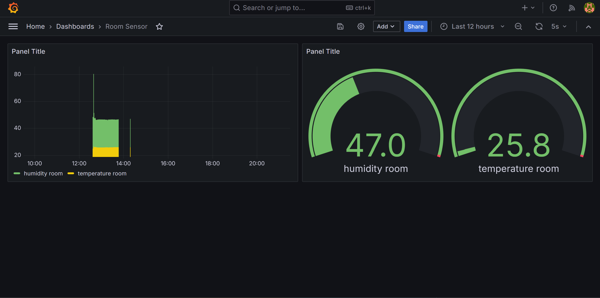

# IoT Temperatur- och Luftfuktighetsövervakning

## Project Description

This project is a Proof of Concept (PoC) for remotely monitoring temperature and humidity using an ESP8266 and a DHT11 sensor, with data visualization in Grafana. This PoC also outlines a future HTTPS implementation plan to meet Cyber Resilience Act (CRA) requirements.

## Table of Contents
- [Setup Instructions](#setup-instructions)
- [PoC Documentation](#poc-documentation)
  - [1. Inledning](#1-inledning)
  - [2. Systemarkitektur](#2-systemarkitektur)
  - [3. Cyber Resilience Act (CRA) Överensstämmelse](#3-cyber-resilience-act-cra-överensstämmelse)
  - [4. Skalbarhet och Framtida Utveckling](#4-skalbarhet-och-framtida-utveckling)
  - [5. Hosting och Certifikathantering](#5-hosting-och-certifikathantering)
  - [6. Grafana Dashboard](#6-grafana-dashboard)
- [Screenshots](#screenshots)

---

## Setup Instructions

To run this project, you'll need to set up your WiFi credentials, InfluxDB token, and IP address.

1. **Create a `secrets.h` file** in the project root (same folder as the main `.ino` or `.cpp` file).
2. Add the following content to `secrets.h`, replacing the placeholders with your actual credentials:
   ```cpp
   #define WIFI_SSID "your_wifi_ssid"
   #define WIFI_PASSWORD "your_wifi_password"
   #define INFLUXDB_TOKEN "your_influxdb_token"
   #define INFLUXDB_IP "your_influxdb_ip"


# **Systemspecificering för IoT-baserad Temperatur- och Luftfuktighetsövervakning**

## **1. Inledning**

Denna Proof of Concept (PoC) beskriver en IoT-lösning för att övervaka temperatur och luftfuktighet i ett rum via en ESP8266-enhet och en DHT11-sensor. Data skickas till en InfluxDB-databas och visualiseras i Grafana för realtidsövervakning. För att uppfylla Cyber Resilience Act (CRA)-kraven innehåller lösningen en säkerhetsplan där HTTPS kommer att implementeras i framtiden för att skydda data i överföring.

## **2. Systemarkitektur**

### **2.1 Enhetsarkitektur**

- **ESP8266**: Används för att läsa data från DHT11-sensorn och skicka data till InfluxDB-databasen över WiFi.
- **DHT11 Sensor**: Mäter rumstemperatur och luftfuktighet och skickar data till ESP8266.

### **2.2 Backend**

- **InfluxDB**: En time-series databas för att lagra temperatur- och luftfuktighetsdata.
- **Grafana**: Används för att visualisera sensordata i realtid samt konfigurera larm.

### **2.3 Kommunikationsprotokoll**

Data överförs via HTTP POST för närvarande. För att möta de långsiktiga kraven på säkerhet-by-design kommer HTTPS att implementeras i produktionsfasen för att skydda data mot avlyssning och manipulation.

## **3. Cyber Resilience Act (CRA) Överensstämmelse**

### **3.1 Säkerhet-by-Design**

I denna PoC överförs data via HTTP, men planen är att i framtiden använda HTTPS med certifikatverifiering för att säkerställa dataintegritet och förhindra obehörig åtkomst. HTTPS kommer att införas via WiFiClientSecure och SSL-certifikat från en betrodd källa som Let’s Encrypt.

### **3.2 Uppdaterbarhet**

ESP8266-enheten stöder Over-The-Air (OTA) uppdateringar, vilket möjliggör enkla säkerhetsuppdateringar och förbättringar i framtiden.

### **3.3 Sårbarhetshantering**

Firmware kommer att granskas och uppdateras regelbundet för att hantera säkerhetsbrister i enlighet med CRA-kraven. HTTPS-planen säkerställer att potentiella sårbarheter hanteras genom kryptering och certifikatverifiering.

## **4. Skalbarhet och Framtida Utveckling**

Lösningen kan enkelt skalas för att inkludera flera ESP8266-enheter eller uppgraderas till ESP32-enheter för bättre prestanda. Grafana och InfluxDB stöder ett utökat antal sensorer, vilket gör det möjligt att övervaka flera rum samtidigt.

### **4.1 Framtida HTTPS-Implementation**

I produktionsfasen kommer dataöverföring att skyddas genom HTTPS, och enhetscertifikat kommer att hanteras via WiFiClientSecure med stöd för certifikat från Let’s Encrypt. Detta säkerställer dataintegritet och uppfyller säkerhetskraven för produktion.

## **5. Hosting och Certifikathantering**

- **Hosting**: I produktionsmiljö kan InfluxDB och Grafana hostas i en säker molnplattform.
- **Certifikathantering**: För att möjliggöra säker HTTPS-kommunikation kommer HTTPS-certifikat från Let’s Encrypt att användas för att kryptera dataöverföring, vilket uppfyller säkerhetskraven i CRA.

## **6. Grafana Dashboard**

